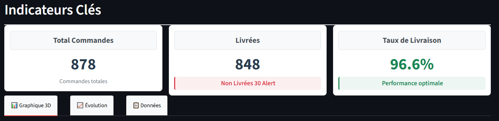

# Northwind Data Warehouse & BI Dashboard

## Overview
This project implements a complete Data Warehouse and Business Intelligence solution for the Northwind Trading Company. It integrates data from multiple operational sources (SQL Server and Microsoft Access), transforms it into a dimensional model, and delivers an interactive dashboard for real-time analytics.

## Key Features
- **Multi-source ETL Pipeline:**  extraction from SQL Server and Microsoft Access  
- **Star Schema Data Warehouse:** Optimized for analytical queries with fact and dimension tables  
- **Interactive Streamlit Dashboard:** Real-time metrics, 3D visualizations, and filtering capabilities  
- **Data Quality Assurance:** Completeness checks, deduplication, and error handling  
- **Scalable Architecture:** Modular design supporting future enhancements  

## Business Impact
- **96.6% Delivery Rate Tracking:** Real-time monitoring of order fulfillment  
- **Unified Historical View:** Integrated analysis across current and legacy data  
- **Actionable Insights:** Customer, employee, and trend analysis with interactive dashboards  

## Documentation
- Full technical report available in **/report/rapport.pdf**
- the presentation video [here](https://drive.google.com/file/d/1TvgCdXnhfsdF9H7xVyI9WTa4WqrzD35F/view?usp=sharing)
- Sample dashboard outputs in Appendices + in **/figures**

##  Technology Stack

| Component         | Technology Used                 |
|-----------------|-------------------------------|
| Source Databases | SQL Server 2019, MS Access     |
| ETL Engine       | Python 3.8+, Pandas      |
| Data Warehouse   | SQL Server 2019                |
| Dashboard        | Streamlit                |
| Data Processing  | NumPy, Pandas                  |
| Connectivity     | ODBC Driver 17                 |

## Getting Started

### Prerequisites
- Python 3.8+  
- SQL Server 2019  
- Microsoft Access Database (optional, for legacy data)  
- ODBC Driver 17 for SQL Server  

### Installation
Clone the repository:
```bash
git clone https://github.com/yourusername/northwind-data-warehouse.git
cd northwind-data-warehouse
```
Install dependencies:
```bash

pip install -r requirements.txt
```
Configure database connections in DatabaseConfig.py:

```bash

SQL_SERVER_CONFIG = {
    'server': 'localhost',
    'database': 'Northwind',
    'username': '..',
    'password': 'your_password'
}
```

Initialize the data warehouse:

```bash

python create_dw.py
```
Run the ETL pipeline:
```bash

python etl.py
```

Launch the dashboard:
```bash

streamlit run dashboard.py
```

## Dashboard Features
**Real-time Metrics**: Total orders, delivery rate, average order value

**Interactive Filters**: Filter by year, customer, employee, and status

**3D Visualizations**: Scatter, surface, and bubble charts for multidimensional analysis

**Export Capabilities**: Download data in CSV or Excel format

**ETL Controls**: One-click refresh of the data pipeline

## ETL Process Overview
**Extraction**: Pull data from SQL Server and Microsoft Access

**Transformation**:

Standardize column names and data types

Resolve ID conflicts between systems

Calculate derived fields (delivery delay, status flags)

**Loading**:

Dimension tables with deduplication logic

Fact tables with intelligent foreign key lookups

Source system tracking for auditability

## Validation Results



## Future Enhancements
Incremental ETL, error notification system

Cloud migration to Azure, real-time streaming

Machine learning integration, natural language queries

## Author
Melissa AMERYAHIA

Student ID: 232331706307


Section: B | Group: 3
